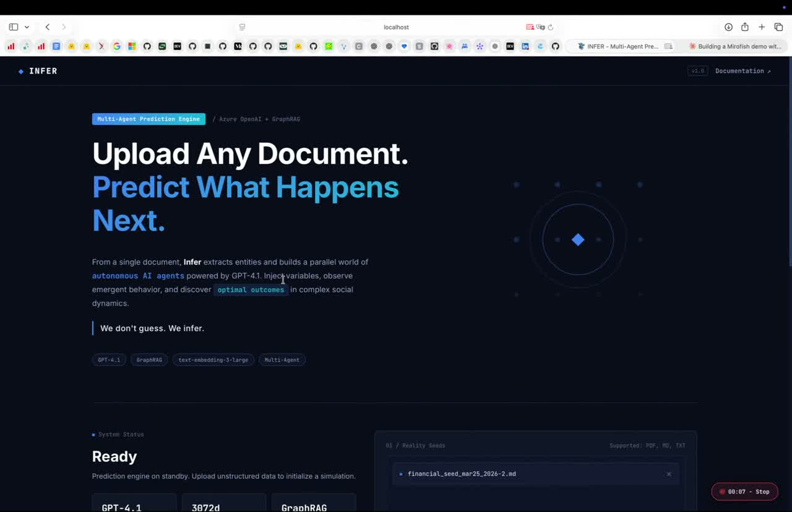
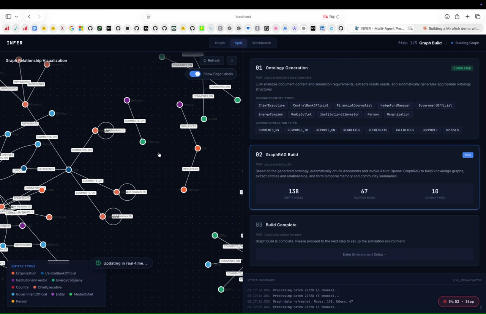
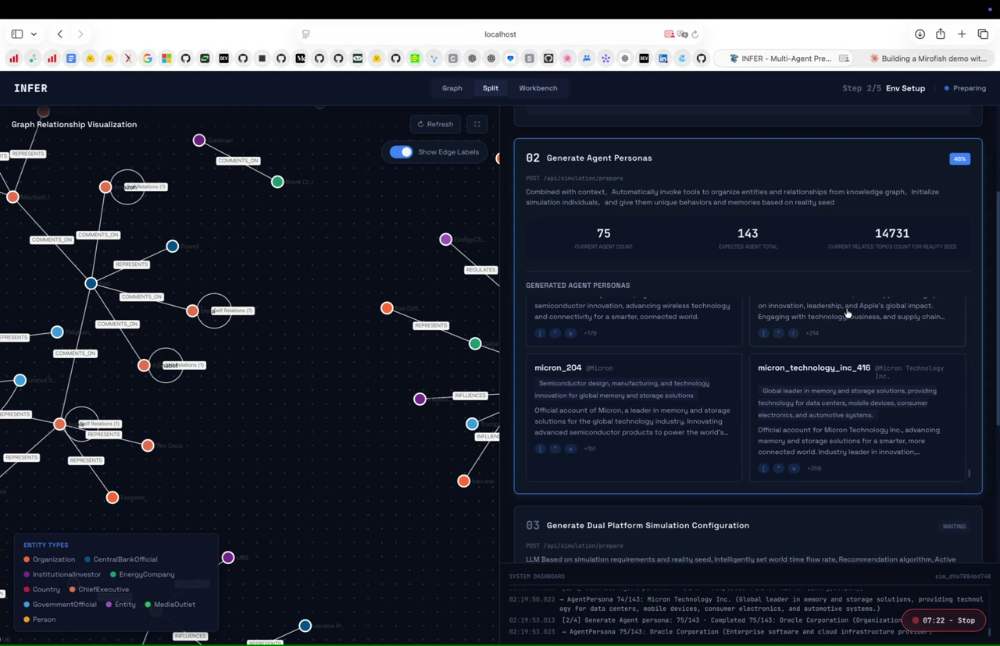
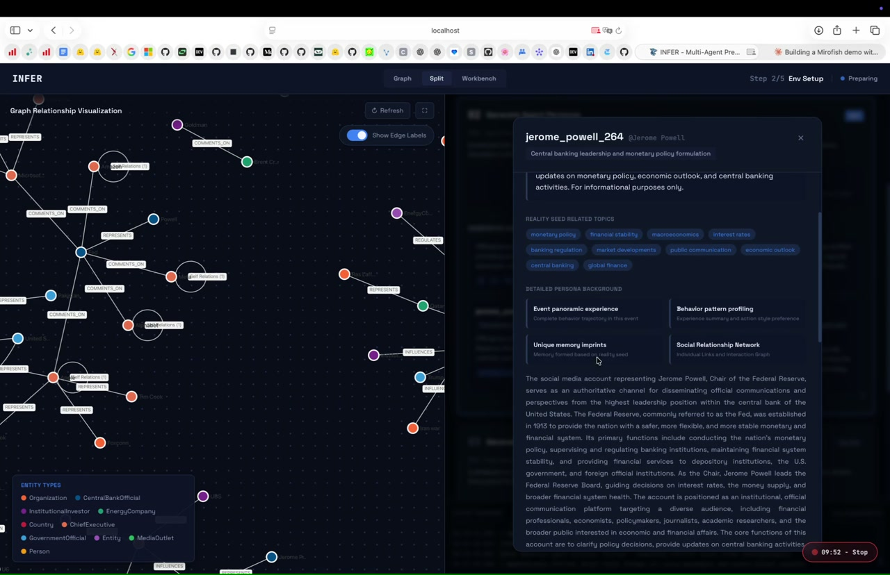
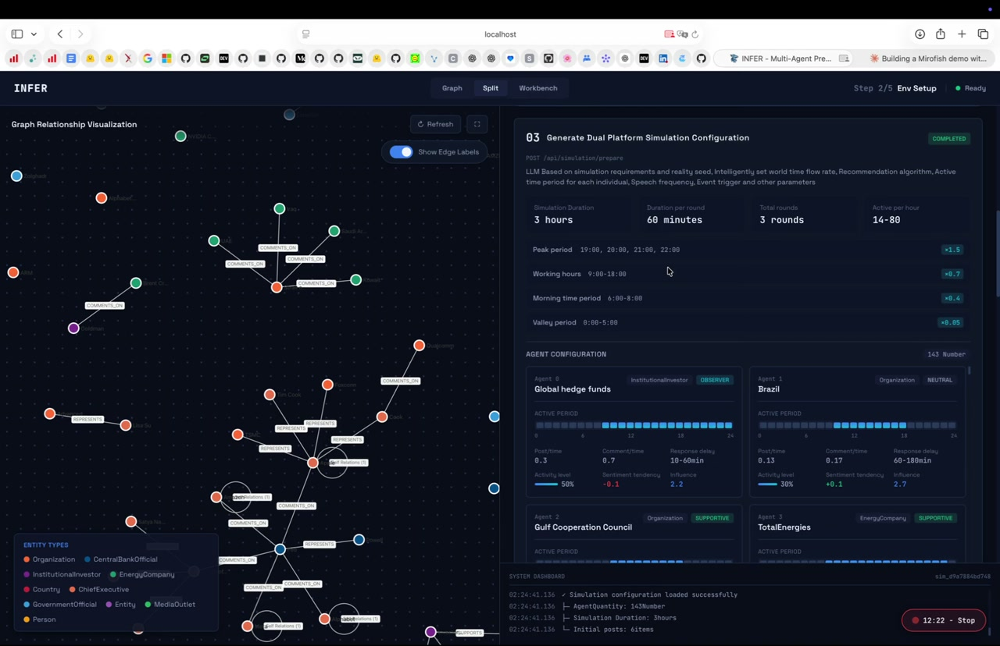
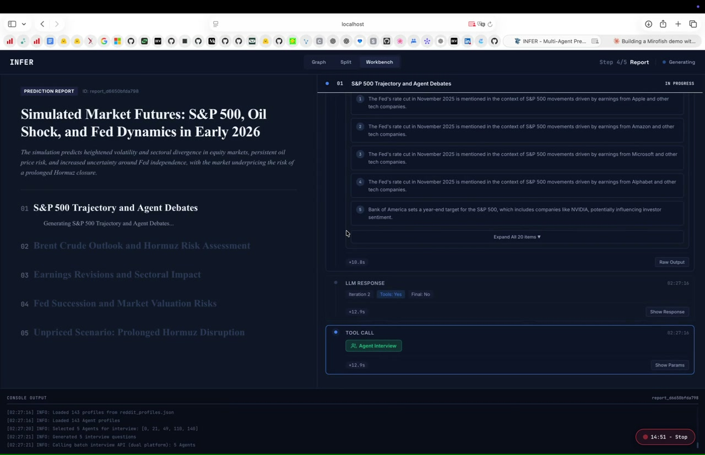
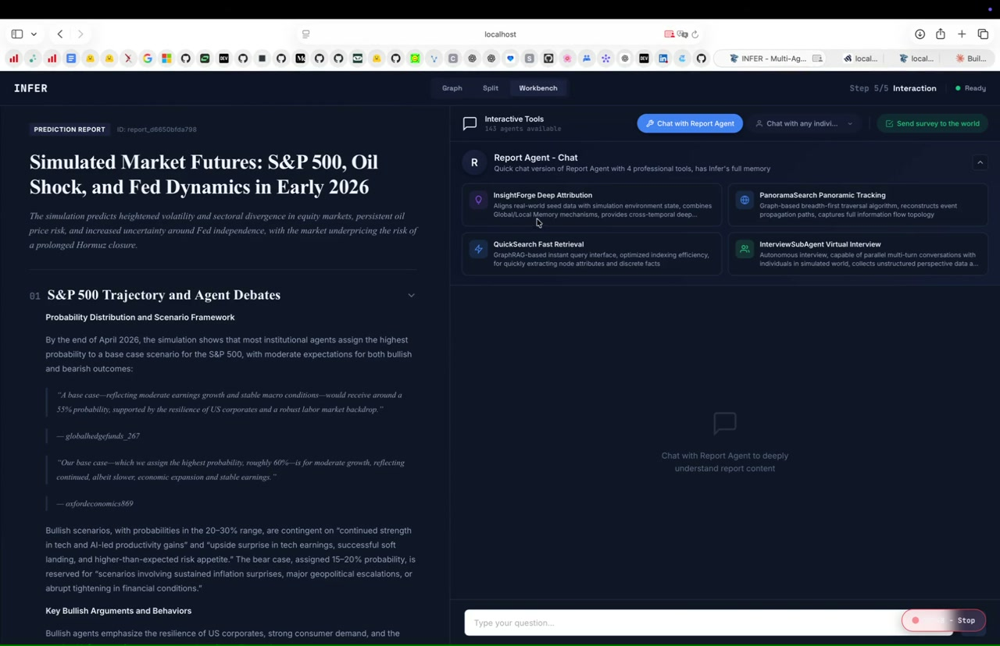
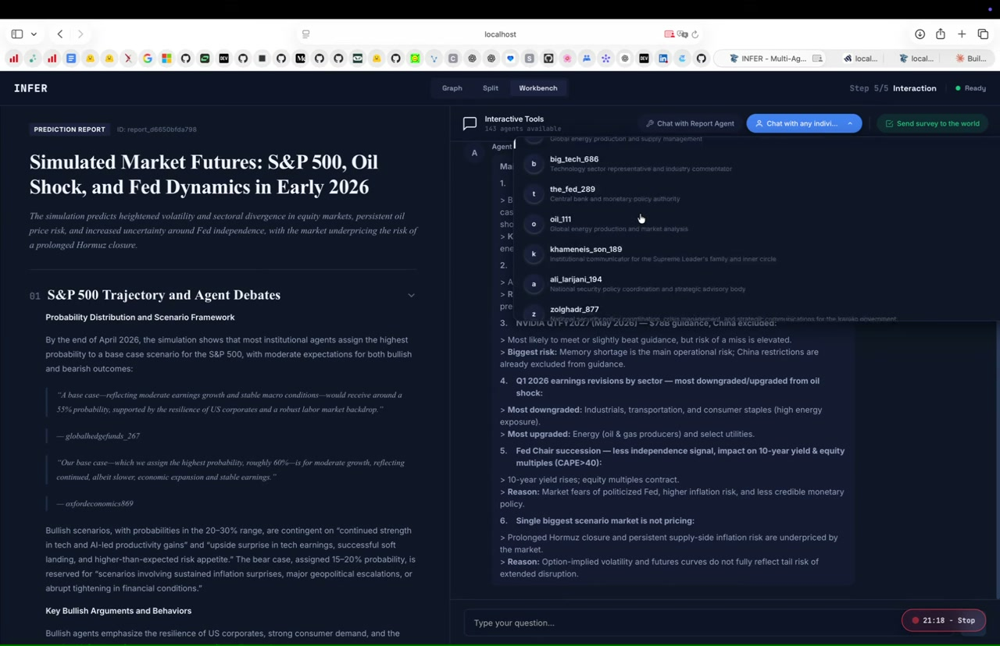

<div align="center">

<br>

# INFER

### We don't guess. We infer.

<br>

[](https://azure.microsoft.com/en-us/products/ai-services/openai-service)
[](https://github.com/microsoft/graphrag)
[](https://platform.openai.com/docs/guides/embeddings)
[](https://vuejs.org/)
[](https://python.org)
[](LICENSE)

<br>

**Upload any document. Simulate the future. Predict what happens next.**

*A multi-agent swarm intelligence engine that simulates public opinion, market sentiment, and social dynamics using GPT-4.1 and in-memory GraphRAG.*

<br>



<br>

</div>

---

## What is Infer?

Infer is an **enterprise-grade multi-agent prediction engine**. Upload any document -- a press release, policy draft, financial report, or news article -- and it generates hundreds of AI agents with unique personalities that simulate real-world reactions on social media platforms. Posts, arguments, opinion shifts, sentiment cascades -- all predicted hour by hour.

```
Document  -->  Knowledge Graph  -->  Agent Personas  -->  Simulation  -->  Prediction Report
  (PDF)        (GraphRAG)           (GPT-4.1)           (Multi-Agent)     (Analysis + Chat)
```

---

## Demo

### Step 1 -- Knowledge Graph Construction

Upload a document and watch Infer extract entities, relationships, and build a live knowledge graph using GraphRAG with Azure OpenAI.

<div align="center">

<br><em>Interactive D3.js knowledge graph with real-time entity extraction -- 138 nodes, 67 relationships, 10 entity types</em>
</div>

<br>

### Step 2 -- Agent Persona Generation

Infer automatically generates hundreds of AI agent personas, each with unique personalities, opinions, influence levels, memory, and behavioral patterns drawn from the knowledge graph.

<div align="center">

<br><em>75 agent groups, 143 personas total, 14,731 topic associations generated from the document</em>
</div>

<br>

<div align="center">

<br><em>Each agent has a full biography, social relationship network, behavioral patterns, and memory imprints</em>
</div>

<br>

### Step 3 -- Multi-Platform Simulation

Configure and run dual-platform simulations (Twitter + Reddit) with customizable parameters: duration, rounds, peak hours, agent activity periods, and recommendation algorithms.

<div align="center">

<br><em>3-hour simulation across 3 rounds with 143 agents, configurable peak/valley periods and agent configurations</em>
</div>

<br>

### Step 4 -- Prediction Report

The Report Agent analyzes post-simulation data, conducts agent interviews, searches the knowledge graph, and generates a structured prediction report with sentiment analysis and probability distributions.

<div align="center">

<br><em>AI-generated prediction report: "Simulated Market Futures: S&P 500, Oil Shock, and Fed Dynamics in Early 2026"</em>
</div>

<br>

### Step 5 -- Deep Interaction

Chat directly with the Report Agent or any individual agent from the simulation. Ask them why they said what they said -- full memory and personality persists.

<div align="center">

<br><em>Interactive tools: Report Agent Chat, Insight Forge, Panoramic Tracking, QuickSearch, and Virtual Interviews</em>
</div>

<br>

<div align="center">

<br><em>Chat with any agent -- big_tech_886, the_fed_209, khameneis_son_369 -- each with their own worldview</em>
</div>

---

## Architecture

```
                    +------------------------------------------+
                    |             Infer Frontend                |
                    |     Vue 3 + D3.js + Dark Premium UI      |
                    +-------------------+----------------------+
                                        |
                                   REST API
                                        |
                    +-------------------v----------------------+
                    |           Flask API Layer                 |
                    |   graph.py | simulation.py | report.py   |
                    +-------------------+----------------------+
                                        |
                    +-------------------v----------------------+
                    |           Service Layer                   |
                    |  EntityReader   GraphToolsService         |
                    |  GraphMemoryUpdater   ReportAgent         |
                    +-------------------+----------------------+
                                        |
              +-------------------------+-------------------------+
              |                                                   |
   +----------v-----------+                          +-----------v-----------+
   |   In-Memory GraphRAG  |                          |    Azure OpenAI       |
   |  +------------------+ |                          |  +------------------+ |
   |  | Vector Search    | |                          |  | GPT-4.1 (LLM)   | |
   |  | Hybrid BM25      | |                          |  | text-embed-3-lg  | |
   |  | JSON Persistence | |                          |  | 3072 dimensions  | |
   |  +------------------+ |                          |  +------------------+ |
   +-----------------------+                          +-----------------------+
```

---

## Key Innovations

| Feature | Original | **Infer** |
|---|---|---|
| **LLM** | Ollama / qwen2.5 (local) | **Azure OpenAI GPT-4.1** |
| **Embeddings** | nomic-embed-text (768d) | **text-embedding-3-large (3072d)** |
| **Graph Database** | Neo4j Community Edition | **In-Memory GraphRAG (zero dependencies)** |
| **Setup** | Docker + Neo4j + Ollama + GPU | **Single `pip install` + API key** |
| **Hardware** | 16GB RAM + 10GB VRAM minimum | **Any machine with internet** |
| **UI** | White/light theme | **Premium dark blue/black theme** |
| **Vector Search** | Neo4j vector indexes | **Numpy cosine similarity + BM25 hybrid** |
| **Data Persistence** | Neo4j database files | **JSON file persistence** |

---

## Use Cases

| Use Case | Description |
|---|---|
| **PR Crisis Testing** | Simulate public reaction to a press release before publishing |
| **Trading Signals** | Feed financial news, observe simulated market sentiment shifts |
| **Policy Impact** | Test draft regulations against simulated public response |
| **Competitive Analysis** | Model how markets react to competitor announcements |
| **Product Launch** | Predict social media response to product announcements |
| **Risk Assessment** | Simulate cascading effects of organizational decisions |

---

## Quick Start

### Prerequisites

- Python 3.11+
- Node.js 18+
- Azure OpenAI API key (or any OpenAI-compatible endpoint)

### Installation

```bash
# Clone the repository
git clone https://github.int.inceptionai.ai/INCEPTION/infer-ai.git
cd infer-ai

# Configure your API key
cp .env.example .env
# Edit .env with your Azure OpenAI credentials

# Install backend dependencies
cd backend
pip install -r requirements.txt

# Install frontend dependencies
cd ../frontend
npm install

# Start the backend
cd ../backend
python run.py

# In another terminal, start the frontend
cd frontend
npm run dev
```

Open `http://localhost:3000` -- that's it.

### Configuration

All settings are in `.env`:

```env
# Azure OpenAI
AZURE_OPENAI_API_KEY=your-key-here
AZURE_OPENAI_ENDPOINT=https://your-endpoint.openai.azure.com/
AZURE_OPENAI_API_VERSION=2024-10-21
AZURE_OPENAI_DEPLOYMENT_NAME=gpt-4.1

# Embeddings
EMBEDDING_MODEL=text-embedding-3-large
EMBEDDING_DIMENSIONS=3072

# Graph Storage (in-memory, no external DB needed)
GRAPH_STORAGE_TYPE=memory
GRAPH_DATA_DIR=./data/graphs
```

---

## Tech Stack

| Component | Technology |
|---|---|
| **LLM** | Azure OpenAI GPT-4.1 |
| **Embeddings** | text-embedding-3-large (3072d) |
| **Knowledge Graph** | In-Memory GraphRAG with JSON persistence |
| **Search** | Hybrid: 0.7x vector cosine + 0.3x BM25 keyword |
| **Backend** | Python 3.11+ / Flask |
| **Frontend** | Vue 3 + D3.js + Vite |
| **Simulation** | OASIS (CAMEL-AI) multi-agent framework |
| **NER/RE** | GPT-4.1 structured extraction |

---

## Project Structure

```
infer-ai/
  backend/
    app/
      api/           # Flask REST API endpoints
      models/        # Data models (Project, Task)
      services/      # Business logic (simulation, reports)
      storage/       # GraphRAG storage layer
      utils/         # LLM client, logger, file parser
    run.py           # Backend entry point
  frontend/
    src/
      api/           # Axios API client
      components/    # Vue step components
      views/         # Page views (Home, Process, Report)
      router/        # Vue Router config
    index.html       # Entry HTML
  .env.example       # Configuration template
  docker-compose.yml # Docker setup (optional)
```

---

## License

MIT License. See [LICENSE](LICENSE) for details.

---

<div align="center">

**Built by Anup Roy**

*INFER -- We don't guess. We infer.*

</div>
